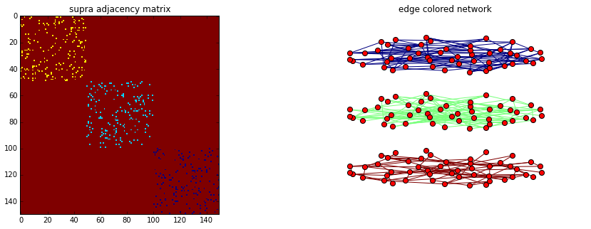
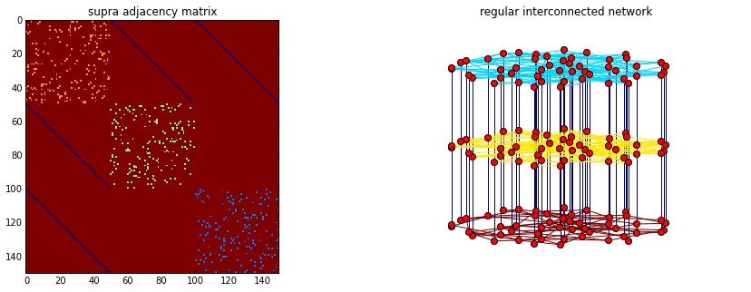
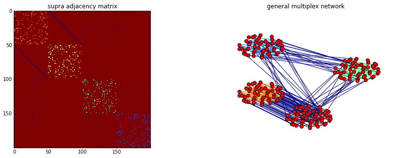

multiNetX v1.0
=========

multiNetX is a python package for the manipulation and study of multilayer networks. The core of this package is a MultilayerGraph, a class that inherits all properties from networkx.Graph(). 

This allows for:

- Creating networks with weighted or unweighted links (only undirected networks are supported in this version)
- Analysing the spectral properties of adjacency or Laplacian matrices 
- Visualizing dynamical processes by coloring the nodes and links accordingly 

multiNetX is part of the deliverables of the LASAGNE project (multi-LAyer SpAtiotemporal Generalized NEtworks), EU/FP7-2012-STREP-318132 (http://complex.ffn.ub.es/~lasagne/)

How to install multiNetX
=========

multinetx does not need intallation. 
You simply download the source files and save them into your file system. 
Then you just add that directory to your PYTHONPATH
	
	export PYTHONPATH=path_to_your_python_libraries/multinetx:$PYTHONPATH

How to use multiNetX
=========

##### Import standard libraries for numerics

    import numpy as np

##### Import lil_matrix to use sparse matrices

    from scipy.sparse import lil_matrix

##### Import the package NetworkX for single layer networks

    import networkx as nx

##### Import the package MultiNetX

    import multinetx as mx

##### Create three Erd"os- R'enyi networks with N nodes for each layer

    N = 8
    g1 = nx.erdos_renyi_graph(N,0.5,seed=218)
    g2 = nx.erdos_renyi_graph(N,0.6,seed=211)
    g3 = nx.erdos_renyi_graph(N,0.7,seed=208)

##### Create an 3Nx3N lil sparse matrix. It will be used to describe the layers interconnection

    adj_block = lil_matrix(np.zeros((N*3,N*3)))

##### Define the type of interconnection among the layers (here we use identity matrices thus connecting one-to-one the nodes among layers)

    adj_block[0:  N,  N:2*N] = np.identity(N)    # L_12
    adj_block[0:  N,2*N:3*N] = np.identity(N)    # L_13
    adj_block[N:2*N,2*N:3*N] = np.identity(N)    # L_23
    
    # use symmetric inter-adjacency matrix
    adj_block += adj_block.T

##### Create an instance of the MultilayerGraph class

    MG = mx.MultilayerGraph(list_of_layers=[g1,g2,g3],
                            inter_adjacency_matrix=adj_block)

The object MG inherits all properties from Graph of networkx, so that
we can calculate adjacency or Laplacian matrices, their eigenvalues, etc.

Spectral properties of Laplacian matrix
=========
              
##### Import standard libraries

    import numpy as np
    from scipy.sparse import lil_matrix
    import matplotlib.pylab as plt

##### Import the package NetworkX and multiNetX

    import networkx as nx
    import multinetx as mx

##### Create two scale-free networks with N nodes for each layer

    N = 20
    g1 = nx.barabasi_albert_graph(N,2,seed=231)
    g2 = nx.barabasi_albert_graph(N,3,seed=231)

##### Create an 2Nx2N lil sparse matrix for interconnecting the two layers

    adj_block = lil_matrix(np.zeros((N*2,N*2)))

##### Define the type of interconnection between the layers (here we use identity matrices thus connecting one-to-one the nodes between layers)

    adj_block[:N,N:] = np.identity(N)    # L_12
    adj_block += adj_block.T

##### Create an instance of the MultilayerGraph class

    mg = mx.MultilayerGraph(list_of_layers=[g1,g2],
                            inter_adjacency_matrix=adj_block)

##### Inter-layer weights (intra-layer weight equals one)

    step = 0.01
    total_steps = 10000
    eigval_all = np.zeros((total_steps,mg.number_of_nodes()))

##### Loop for scanning inter-layer weight with ::step for ::total_steps

    for n in range(total_steps):
        inter_diff = step * n
        diffusion_constants = mg.set_edges_weights(intra_layer_edges_weight=1.0,
                                            inter_layer_edges_weight=inter_diff)
        # Laplacian spectrum        
        eigval_all[n] = nx.laplacian_spectrum(mg,weight="weight")

##### Plot the eigenvalues as a function of inter-layer coupling

    fig = plt.figure()
    fig.clf()
    ax = fig.add_subplot(111)
    ax.tick_params(axis='both',which='major',labelsize=14)
    ax.set_title('Spectrum of ' + mg.name,fontsize=10)
    ax.set_xlabel('$D_x$',fontsize=14)
    ax.set_ylabel('$\lambda_2$,...,$\lambda_{'+\
                    '{}'.format(N*mg.number_of_layers())+\
                    '}$',fontsize=14)
    ax.set_xscale('log')
    ax.set_yscale('log')
    ax.set_ylim(bottom=step,top=total_steps)
    ax.set_xlim(step,step*total_steps)
    ax.plot([step*n for n in range(total_steps)],eigval_all,linewidth=1)
    plt.show()

Plot multiplex networks
=========
     
##### Import standard libraries

    import numpy as np
    from scipy.sparse import lil_matrix

    import matplotlib.pyplot as plt

##### Import the package NetworkX and MultiNetX

    import networkx as nx
    import multinetx as mx

##### Create three Erd"os- R'enyi networks with N nodes for each layer

    N = 50
    g1 = nx.erdos_renyi_graph(N,0.07,seed=218)
    g2 = nx.erdos_renyi_graph(N,0.07,seed=211)
    g3 = nx.erdos_renyi_graph(N,0.07,seed=208)

#### Edge colored nertwork (no inter-connected layers)

##### Create the multiplex network

    MG = mx.MultilayerGraph(list_of_layers=[g1,g2,g3])

##### Set weights to the edges

    MG.set_intra_edges_weights(layer=0,weight=1)
    MG.set_intra_edges_weights(layer=1,weight=2)
    MG.set_intra_edges_weights(layer=2,weight=3)

##### Plot the adjacency matrix and the multiplex networks

    fig = plt.figure(figsize=(15,5))
    ax1 = fig.add_subplot(121)
    ax1.imshow(nx.adjacency_matrix(MG,weight='weight').todense(),
              origin='upper',interpolation='nearest',cmap=plt.cm.jet_r)
    ax1.set_title('supra adjacency matrix')
    
    ax2 = fig.add_subplot(122)
    ax2.axis('off')
    ax2.set_title('edge colored network')
    pos = mx.get_position(MG,nx.fruchterman_reingold_layout(g1),
                          layer_vertical_shift=0.2,
                          layer_horizontal_shift=0.0,
                          proj_angle=47)
    nx.draw_networkx(MG,pos=pos,ax=ax2,node_size=50,with_labels=False,
                     edge_color=[MG[a][b]['weight'] for a,b in MG.edges()],
                     edge_cmap=plt.cm.jet_r)
    plt.show()

#### Regular interconnected multiplex

##### Define the type of interconnection between the layers

    adj_block = lil_matrix(np.zeros((N*3,N*3)))
    
    adj_block[0:  N,  N:2*N] = np.identity(N)    # L_12
    adj_block[0:  N,2*N:3*N] = np.identity(N)    # L_13
    #adj_block[N:2*N,2*N:3*N] = np.identity(N)    # L_23
    adj_block += adj_block.T

##### Create an instance of the MultilayerGraph class

    MG = mx.MultilayerGraph(list_of_layers=[g1,g2,g3], 
                            inter_adjacency_matrix=adj_block)
    
    MG.set_edges_weights(inter_layer_edges_weight=4)
    
    MG.set_intra_edges_weights(layer=0,weight=1)
    MG.set_intra_edges_weights(layer=1,weight=2)
    MG.set_intra_edges_weights(layer=2,weight=3)

##### Plot the adjacency matrix and the multiplex networks

    fig = plt.figure(figsize=(15,5))
    ax1 = fig.add_subplot(121)
    ax1.imshow(nx.adjacency_matrix(MG,weight='weight').todense(),
              origin='upper',interpolation='nearest',cmap=plt.cm.jet_r)
    ax1.set_title('supra adjacency matrix')
    
    ax2 = fig.add_subplot(122)
    ax2.axis('off')
    ax2.set_title('regular interconnected network')
    pos = mx.get_position(MG,nx.fruchterman_reingold_layout(MG.get_layer(0)),
                          layer_vertical_shift=1.4,
                          layer_horizontal_shift=0.0,
                          proj_angle=7)
    nx.draw_networkx(MG,pos=pos,ax=ax2,node_size=50,with_labels=False,
                     edge_color=[MG[a][b]['weight'] for a,b in MG.edges()],
                     edge_cmap=plt.cm.jet_r)
    plt.show()

#### General multiplex multiplex 

##### Define the type of interconnection between the layers

    adj_block = lil_matrix(np.zeros((N*4,N*4)))
    
    adj_block[0  :  N ,   N:2*N] = np.identity(N)   # L_12
    adj_block[0  :  N , 2*N:3*N] = np.random.poisson(0.005,size=(N,N))   # L_13
    adj_block[0  :  N , 3*N:4*N] = np.random.poisson(0.006,size=(N,N))   # L_34
    adj_block[3*N:4*N , 2*N:3*N] = np.random.poisson(0.008,size=(N,N))   # L_14
    adj_block += adj_block.T
    adj_block[adj_block>1] = 1

##### Create an instance of the MultilayerGraph class

    MG = mx.MultilayerGraph(list_of_layers=[g1,g2,g3,g1],
                            inter_adjacency_matrix=adj_block)
    
    MG.set_edges_weights(inter_layer_edges_weight=4)
    
    MG.set_intra_edges_weights(layer=0,weight=1)
    MG.set_intra_edges_weights(layer=1,weight=2)
    MG.set_intra_edges_weights(layer=2,weight=3)
    MG.set_intra_edges_weights(layer=3,weight=5)

##### Plot the adjacency matrix and the multiplex networks

    fig = plt.figure(figsize=(15,5))
    ax1 = fig.add_subplot(121)
    ax1.imshow(nx.adjacency_matrix(MG,weight='weight').todense(),
              origin='upper',interpolation='nearest',cmap=plt.cm.jet_r)
    ax1.set_title('supra adjacency matrix')
    
    ax2 = fig.add_subplot(122)
    ax2.axis('off')
    ax2.set_title('general multiplex network')
    pos = mx.get_position(MG,nx.fruchterman_reingold_layout(MG.get_layer(0)),
                          layer_vertical_shift=.6,
                          layer_horizontal_shift=0.9,
                          proj_angle=.6)
    nx.draw_networkx(MG,pos=pos,ax=ax2,node_size=50,with_labels=False,
                     edge_color=[MG[a][b]['weight'] for a,b in MG.edges()],
                     edge_cmap=plt.cm.jet_r)
    plt.show()

Copyright
=========

(C) Copyright 2013-2015, Nikos E Kouvaris

This code has no warranty whatsoever and any kind of support is provided. 
You are free to do what you like with this code as long as you leave this 
copyright in place.

(C) Copyright 2013-2015, Nikos E Kouvaris

Each file in this folder is part of the multiNetX package.

multiNetX is free software: you can redistribute it and/or modify it 
under the terms of the GNU General Public License as published by the 
Free Software Foundation, either version 3 of the License, 
or (at your option) any later version.

multiNetX is distributed in the hope that it will be useful, 
but WITHOUT ANY WARRANTY; without even the implied warranty of 
MERCHANTABILITY or FITNESS FOR A PARTICULAR PURPOSE. 
See the GNU General Public License for more details.

You should have received a copy of the GNU General Public License 
along with the package. If not, see http://www.gnu.org/licenses/. 
