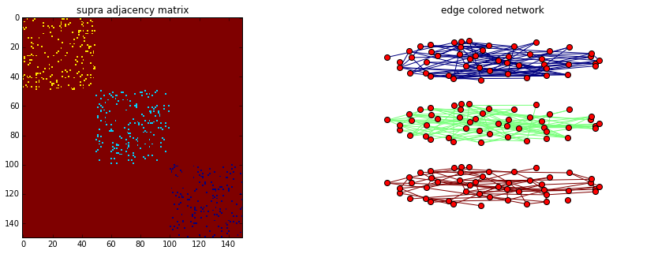
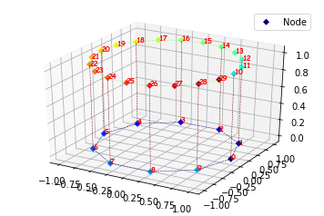

 multiNetX version 3.0 
=========

multiNetX is a python package for the manipulation and visualization of 
multilayer networks. The core of this package is a MultilayerGraph, a class 
that inherits all properties from networkx.Graph(). 


This allows for:


- Creating networks with weighted or unweighted links (only undirected networks are supported in this version)
- Analysing the spectral properties of adjacency or Laplacian matrices 
- Visualizing dynamical processes by coloring the nodes and links accordingly 


# How to install multiNetX

You have to execute the following command in your terminal:
    
```bash
pip install git+https://github.com/nkoub/multinetx.git
```

**Or**
   
1. Clone the repository of multinetx into your system:
    ```bash
    git clone https://github.com/nkoub/multinetx.git
    ```
2. Enter in the multinetx directory:
    ```bash
    cd multinetx
    ```
3. and then simply write:
    ```bash
    pip install .
    ```


# How to use multiNetX


#### Import standard libraries for numerics


```python
import numpy as np
```

#### Import the package MultiNetX

```python
import multinetx as mx
```

# Create a multiplex 1st way

#### Create three Erd"os- R'enyi networks with N nodes for each layer

```python
N = 5
g1 = mx.generators.erdos_renyi_graph(N,0.5,seed=218)
g2 = mx.generators.erdos_renyi_graph(N,0.6,seed=211)
g3 = mx.generators.erdos_renyi_graph(N,0.7,seed=208)
```
#### Create an 3Nx3N lil sparse matrix. It will be used to describe the layers interconnection

```python
adj_block = mx.lil_matrix(np.zeros((N*3,N*3)))
```
#### Define the type of interconnection among the layers (here we use identity matrices thus connecting one-to-one the nodes among layers)

```python
adj_block[0:  N,  N:2*N] = np.identity(N)    # L_12
adj_block[0:  N,2*N:3*N] = np.identity(N)    # L_13
adj_block[N:2*N,2*N:3*N] = np.identity(N)    # L_23
    
# use symmetric inter-adjacency matrix
adj_block += adj_block.T
```
#### Create an instance of the MultilayerGraph class

```python
mg = mx.MultilayerGraph(list_of_layers=[g1,g2,g3],
                        inter_adjacency_matrix=adj_block)
```
#### Weights can be added to the edges

```python
mg.set_edges_weights(intra_layer_edges_weight=2,
                     inter_layer_edges_weight=3)
```
# Create a multiplex 2nd way

```python
mg = mx.MultilayerGraph()
```
#### Add layers

```python
mg.add_layer(mx.generators.erdos_renyi_graph(N,0.5,seed=218))
mg.add_layer(mx.generators.erdos_renyi_graph(N,0.6,seed=211))
mg.add_layer(mx.generators.erdos_renyi_graph(N,0.7,seed=208))
```
#### Create an instance of the MultilayerGraph class

```python
mg.layers_interconnect(inter_adjacency_matrix=adj_block)
```
#### Weights can be added to the edges

```python
mg.set_edges_weights(intra_layer_edges_weight=2,
                     inter_layer_edges_weight=3)
```

The object mg inherits all properties from Graph of networkX, so that
we can calculate adjacency or Laplacian matrices, their eigenvalues, etc.


How to plot multiplex networks
=========
     

##### Import standard libraries

```python
import numpy as np
import matplotlib.pyplot as plt
```
##### Import the package MultiNetX

```python
import multinetx as mx
```
##### Create three Erd"os- R'enyi networks with N nodes for each layer

```python
N = 50
g1 = mx.erdos_renyi_graph(N,0.07,seed=218)
g2 = mx.erdos_renyi_graph(N,0.07,seed=211)
g3 = mx.erdos_renyi_graph(N,0.07,seed=208)
```
### Edge colored nertwork (no inter-connected layers)

##### Create the multiplex network

```python
mg = mx.MultilayerGraph(list_of_layers=[g1,g2,g3])
```
##### Set weights to the edges

```python
mg.set_intra_edges_weights(layer=0,weight=1)
mg.set_intra_edges_weights(layer=1,weight=2)
mg.set_intra_edges_weights(layer=2,weight=3)
```
##### Plot the adjacency matrix and the multiplex networks

```python
fig = plt.figure(figsize=(15,5))
ax1 = fig.add_subplot(121)
ax1.imshow(mx.adjacency_matrix(mg,weight='weight').todense(),
		  origin='upper',interpolation='nearest',cmap=plt.cm.jet_r)
ax1.set_title('supra adjacency matrix')

ax2 = fig.add_subplot(122)
ax2.axis('off')
ax2.set_title('edge colored network')
pos = mx.get_position(mg,mx.fruchterman_reingold_layout(g1),
					  layer_vertical_shift=0.2,
					  layer_horizontal_shift=0.0,
					  proj_angle=47)
mx.draw_networkx(mg,pos=pos,ax=ax2,node_size=50,with_labels=False,
				 edge_color=[mg[a][b]['weight'] for a,b in mg.edges()],
				 edge_cmap=plt.cm.jet_r)
plt.show()
```




### Regular interconnected multiplex

##### Define the type of interconnection between the layers

```python
adj_block = mx.lil_matrix(np.zeros((N*3,N*3)))

adj_block[0:  N,  N:2*N] = np.identity(N)    # L_12
adj_block[0:  N,2*N:3*N] = np.identity(N)    # L_13
#adj_block[N:2*N,2*N:3*N] = np.identity(N)    # L_23
adj_block += adj_block.T
```
##### Create an instance of the MultilayerGraph class

```python
mg = mx.MultilayerGraph(list_of_layers=[g1,g2,g3], 
						inter_adjacency_matrix=adj_block)

mg.set_edges_weights(inter_layer_edges_weight=4)

mg.set_intra_edges_weights(layer=0,weight=1)
mg.set_intra_edges_weights(layer=1,weight=2)
mg.set_intra_edges_weights(layer=2,weight=3)
```
##### Plot the adjacency matrix and the multiplex networks

```python
fig = plt.figure(figsize=(15,5))
ax1 = fig.add_subplot(121)
ax1.imshow(mx.adjacency_matrix(mg,weight='weight').todense(),
		  origin='upper',interpolation='nearest',cmap=plt.cm.jet_r)
ax1.set_title('supra adjacency matrix')

ax2 = fig.add_subplot(122)
ax2.axis('off')
ax2.set_title('regular interconnected network')
pos = mx.get_position(mg,mx.fruchterman_reingold_layout(mg.get_layer(0)),
					  layer_vertical_shift=1.4,
					  layer_horizontal_shift=0.0,
					  proj_angle=7)
mx.draw_networkx(mg,pos=pos,ax=ax2,node_size=50,with_labels=False,
				 edge_color=[mg[a][b]['weight'] for a,b in mg.edges()],
				 edge_cmap=plt.cm.jet_r)
plt.show()
```


### General multiplex multiplex 

##### Define the type of interconnection between the layers

```python
adj_block = mx.lil_matrix(np.zeros((N*4,N*4)))

adj_block[0  :  N ,   N:2*N] = np.identity(N)   # L_12
adj_block[0  :  N , 2*N:3*N] = np.random.poisson(0.005,size=(N,N))   # L_13
adj_block[0  :  N , 3*N:4*N] = np.random.poisson(0.006,size=(N,N))   # L_34
adj_block[3*N:4*N , 2*N:3*N] = np.random.poisson(0.008,size=(N,N))   # L_14
adj_block += adj_block.T
adj_block[adj_block>1] = 1
```
##### Create an instance of the MultilayerGraph class

```python
mg = mx.MultilayerGraph(list_of_layers=[g1,g2,g3,g1],
						inter_adjacency_matrix=adj_block)

mg.set_edges_weights(inter_layer_edges_weight=5)

mg.set_intra_edges_weights(layer=0,weight=1)
mg.set_intra_edges_weights(layer=1,weight=2)
mg.set_intra_edges_weights(layer=2,weight=3)
mg.set_intra_edges_weights(layer=3,weight=4)
```
##### Plot the adjacency matrix and the multiplex networks

```python
fig = plt.figure(figsize=(15,5))
ax1 = fig.add_subplot(121)
ax1.imshow(mx.adjacency_matrix(mg,weight='weight').todense(),
		  origin='upper',interpolation='nearest',cmap=plt.cm.jet_r)
ax1.set_title('supra adjacency matrix')

ax2 = fig.add_subplot(122)
ax2.axis('off')
ax2.set_title('general multiplex network')
pos = mx.get_position(mg,mx.fruchterman_reingold_layout(mg.get_layer(0)),
					  layer_vertical_shift=.3,
					  layer_horizontal_shift=0.9,
					  proj_angle=.2)
mx.draw_networkx(mg,pos=pos,ax=ax2,node_size=50,with_labels=False,
				 edge_color=[mg[a][b]['weight'] for a,b in mg.edges()],
				 edge_cmap=plt.cm.jet_r)
plt.show()
```


How to plot 3D multiplex networks
=========

#### Import specific libraries


```python
import numpy as np #  to use matrix
import matplotlib.pyplot as plt # to use plot
import networkx as nx # to use graphs
import multinetx as mx # to use multinet
import math # to use floor
import matplotlib.cm as cmx # to use cmap (for data color values)
import matplotlib.colors as colors # to use cmap (for data color values)
import matplotlib.cbook as cb # to test if an object is a string

from mpl_toolkits.mplot3d import Axes3D # to use 3D plot
```

#### Create multinet


```python
N1 = 10
g1 = nx.cycle_graph(N1)
N2 = 2*N1
g2 = nx.cycle_graph(N2)

adj_block = mx.lil_matrix(np.zeros((N1+N2,N1+N2)))

for i in range(N1):
    adj_block[i,N1+2*i] = 1

adj_block += adj_block.T

mg = mx.MultilayerGraph(list_of_layers=[g1,g2],inter_adjacency_matrix=adj_block)
```

#### Plot multiplex networks by layer


```python
# Create the figure
fig = plt.figure()
# Create 3D axes
ax = fig.add_subplot(111, projection='3d')

pos = mx.get_position3D(mg)


intra_c = ['b','r']
inter_c = 'grey'
layer_c = ['b','r']

mg.set_edges_weights(inter_layer_edges_weight=1, intra_layer_edges_weight=1)
edge_color=[mg[a][b]['weight'] for a,b in mg.edges()]


mx.FigureByLayer(mg, pos, ax, intra_edge_color=intra_c,node_color=layer_c, inter_edge_color=inter_c)
ax.axis('off')
```


    (-1.0999999812245371,
     1.0999999991059304,
     -1.0999999595281706,
     1.0999999980727702)


#### Plot multiplex networks by nodes and edges


```python
# Create the figure
fig = plt.figure()
# Create 3D axes
ax = fig.add_subplot(111, projection='3d')
# Get position of all nodes
pos = mx.get_position3D(mg)
# Set edges weights
mg.set_intra_edges_weights(layer=0,weight=1)
mg.set_intra_edges_weights(layer=1,weight=2)
mg.set_edges_weights(inter_layer_edges_weight=3)

# Get edges and nodes color
edge_color=[mg.edges.get((a,b))['weight'] for a,b in mg.edges()]
node_color=[i for i in mg.nodes]

# Plot multiplex network using options
mx.Figure3D(mg, pos, ax, edge_color=edge_color, node_color=node_color, 
         node_shape = 'D', edge_linewidth = 0.5, node_linewidth = 0,
         edge_style = 'dashed', label = 'Node', with_labels = True,
         font_size = 8, font_color = 'red', font_weight = 'heavy', 
         font_family = 'fantasy')
# Print legend
ax.legend(scatterpoints=1)
```

    /home/icarrasco/fnh_k/multinetx_display/multinetx/draw.py:439: MatplotlibDeprecationWarning: The is_string_like function was deprecated in version 2.1.
      if not cb.is_string_like(label):


    <matplotlib.legend.Legend at 0x7fcc9b69fbe0>





#### Plot partial multiplex networks by nodes and edges


```python
# Create the figure
fig = plt.figure()
# Create 3D axes
ax = fig.add_subplot(111, projection='3d')

# Get position of nodes
pos = mx.get_position3D(mg)
# Choose some edges
edge_list = [(0, 1),(0, 10),(0, 9),(1, 2),(1, 12),(2, 3),(2, 14),(3, 16),(3, 4),(4, 18),(4, 5),(5, 20),(5, 6),(6, 22),(6, 7),(7, 8),(7, 24)]
# Choose the edges color
edge_color = [np.random.randint(1,100) for i in edge_list]
# Choose some nodes
node_list = [0,2,4,6,8,10,12,14,16,18,20]
# Choose the nodes color
node_color = [0,2,4,6,8,10,12,14,16,18,20]
# Plot the partial mutiplex network
mx.Figure3D(mg, pos, ax, node_list=node_list, node_color=node_color, edge_list=edge_list, edge_color = edge_color)
```


    


How to cite multiNetX 
=========
If multiNetX was useful and facilitated your research and work flow you can 
use a reference in your publications by citing either of the following papers
for which multiNetX was originally developed:
 + R. Amato, N. E Kouvaris, M. San Miguel and A. Diaz-Guilera, 
Opinion competition dynamics on multiplex networks, New J. Phys. DOI: https://doi.org/10.1088/1367-2630/aa936a
 + N. E. Kouvaris, S. Hata and A. Diaz-Guilera, 
Pattern formation in multiplex networks, 
Scientific Reports 5, 10840 (2015). http://www.nature.com/srep/2015/150604/srep10840/full/srep10840.html
 + A. Sole-Ribata, M. De Domenico, N. E. Kouvaris, A. Diaz-Guilera, 
S. Gomez and A. Arenas, 
Spectral properties of the Laplacian of a multiplex network, 
Phys. Rev. E 88, 032807 (2013). http://journals.aps.org/pre/abstract/10.1103/PhysRevE.88.032807

Copyright
=========

(C) Copyright 2013-2019, Nikos E Kouvaris

Each file in this folder is part of the multiNetX package.


**multiNetX v1.0** is part of the deliverables of the LASAGNE project 
(multi-LAyer SpAtiotemporal Generalized NEtworks),
EU/FP7-2012-STREP-318132 (http://complex.ffn.ub.es/~lasagne/)


**multiNetX v2.0** is an extension of the version 1.0 and has the 
additions made by *Ines Carrasco* (https://github.com/InesCarrasco) 
during her internship in the University of Namur 
and the Namur Institute for Complex Systems (naXys) the summer of 2018.

**multiNetX v3.0** provides is buid on the previous versions and 
provides an easy installation m,ethod via pypip

multiNetX is free software: you can redistribute it and/or modify
it under the terms of the GNU General Public License as published by
the Free Software Foundation, either version 3 of the License, or
(at your option) any later version.

multiNetX is distributed in the hope that it will be useful,
but WITHOUT ANY WARRANTY; without even the implied warranty of
MERCHANTABILITY or FITNESS FOR A PARTICULAR PURPOSE.  See the
GNU General Public License for more details.

You should have received a copy of the GNU General Public License
along with this program.  If not, see <http://www.gnu.org/licenses/>.


