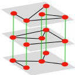

 multiNetX v1.0 
=========

multiNetX is a python package for the manipulation and visualization of multilayer networks. The core of this package 
is a MultilayerGraph, a class that inherits all properties
 from networkx.Graph(). 


This allows for:


- Creating networks with weighted or unweighted links (only undirected networks are supported in this version)
- Analysing the spectral properties of adjacency or Laplacian matrices 
- Visualizing dynamical processes by coloring the nodes and links accordingly 


How to install multiNetX
=========

You simply download/clone the source files into the directory you keep your python scripts. 
Then you add that directory to your PYTHONPATH.
In Unix/Linux you can do this by adding into your .bashrc file the two following lines:
	
	export PYTHONPATH=/home/your_username/your_python_libs:$PYTHONPATH
	export PYTHONPATH=/home/your_username/your_python_libs/multinetx:$PYTHONPATH


After request of some users I give here an example of how to "install" multinetx:

Create a directory for your python libraries (if you do not have already)

	mkdir your_python_libs

Enter this directory

	cd your_python_libs

Clone the multinetx

	git clone https://github.com/nkoub/multinetx.git

Add multinetx to your PYTHONPATH by adding to your .bashrc the two following lines:

	export PYTHONPATH=/home/your_username/your_python_libs:$PYTHONPATH
	export PYTHONPATH=/home/your_username/your_python_libs/multinetx:$PYTHONPATH


How to use multiNetX
=========


#### Import standard libraries for numerics


```python
import numpy as np
```

#### Import the package MultiNetX

```python
import multinetx as mx
```

# Create a multiplex 1st way

#### Create three Erd"os- R'enyi networks with N nodes for each layer

```python
N = 5
g1 = mx.generators.erdos_renyi_graph(N,0.5,seed=218)
g2 = mx.generators.erdos_renyi_graph(N,0.6,seed=211)
g3 = mx.generators.erdos_renyi_graph(N,0.7,seed=208)
```
#### Create an 3Nx3N lil sparse matrix. It will be used to describe the layers interconnection

```python
adj_block = mx.lil_matrix(np.zeros((N*3,N*3)))
```
#### Define the type of interconnection among the layers (here we use identity matrices thus connecting one-to-one the nodes among layers)

```python
adj_block[0:  N,  N:2*N] = np.identity(N)    # L_12
adj_block[0:  N,2*N:3*N] = np.identity(N)    # L_13
adj_block[N:2*N,2*N:3*N] = np.identity(N)    # L_23
    
# use symmetric inter-adjacency matrix
adj_block += adj_block.T
```
#### Create an instance of the MultilayerGraph class

```python
mg = mx.MultilayerGraph(list_of_layers=[g1,g2,g3],
                        inter_adjacency_matrix=adj_block)
```
#### Weights can be added to the edges

```python
mg.set_edges_weights(intra_layer_edges_weight=2,
                     inter_layer_edges_weight=3)
```
# Create a multiplex 2nd way

```python
mg = mx.MultilayerGraph()
```
#### Add layers

```python
mg.add_layer(mx.generators.erdos_renyi_graph(N,0.5,seed=218))
mg.add_layer(mx.generators.erdos_renyi_graph(N,0.6,seed=211))
mg.add_layer(mx.generators.erdos_renyi_graph(N,0.7,seed=208))
```
#### Create an instance of the MultilayerGraph class

```python
mg.layers_interconnect(inter_adjacency_matrix=adj_block)
```
#### Weights can be added to the edges

```python
mg.set_edges_weights(intra_layer_edges_weight=2,
                     inter_layer_edges_weight=3)
```

The object mg inherits all properties from Graph of networkX, so that
we can calculate adjacency or Laplacian matrices, their eigenvalues, etc.


How to plot multiplex networks
=========
     

##### Import standard libraries

```python
import numpy as np
import matplotlib.pyplot as plt
```
##### Import the package MultiNetX

```python
import multinetx as mx
```
##### Create three Erd"os- R'enyi networks with N nodes for each layer

```python
N = 50
g1 = mx.erdos_renyi_graph(N,0.07,seed=218)
g2 = mx.erdos_renyi_graph(N,0.07,seed=211)
g3 = mx.erdos_renyi_graph(N,0.07,seed=208)
```
### Edge colored nertwork (no inter-connected layers)

##### Create the multiplex network

```python
mg = mx.MultilayerGraph(list_of_layers=[g1,g2,g3])
```
##### Set weights to the edges

```python
mg.set_intra_edges_weights(layer=0,weight=1)
mg.set_intra_edges_weights(layer=1,weight=2)
mg.set_intra_edges_weights(layer=2,weight=3)
```
##### Plot the adjacency matrix and the multiplex networks

```python
fig = plt.figure(figsize=(15,5))
ax1 = fig.add_subplot(121)
ax1.imshow(mx.adjacency_matrix(mg,weight='weight').todense(),
		  origin='upper',interpolation='nearest',cmap=plt.cm.jet_r)
ax1.set_title('supra adjacency matrix')

ax2 = fig.add_subplot(122)
ax2.axis('off')
ax2.set_title('edge colored network')
pos = mx.get_position(mg,mx.fruchterman_reingold_layout(g1),
					  layer_vertical_shift=0.2,
					  layer_horizontal_shift=0.0,
					  proj_angle=47)
mx.draw_networkx(mg,pos=pos,ax=ax2,node_size=50,with_labels=False,
				 edge_color=[mg[a][b]['weight'] for a,b in mg.edges()],
				 edge_cmap=plt.cm.jet_r)
plt.show()
```


### Regular interconnected multiplex

##### Define the type of interconnection between the layers

```python
adj_block = mx.lil_matrix(np.zeros((N*3,N*3)))

adj_block[0:  N,  N:2*N] = np.identity(N)    # L_12
adj_block[0:  N,2*N:3*N] = np.identity(N)    # L_13
#adj_block[N:2*N,2*N:3*N] = np.identity(N)    # L_23
adj_block += adj_block.T
```
##### Create an instance of the MultilayerGraph class

```python
mg = mx.MultilayerGraph(list_of_layers=[g1,g2,g3], 
						inter_adjacency_matrix=adj_block)

mg.set_edges_weights(inter_layer_edges_weight=4)

mg.set_intra_edges_weights(layer=0,weight=1)
mg.set_intra_edges_weights(layer=1,weight=2)
mg.set_intra_edges_weights(layer=2,weight=3)
```
##### Plot the adjacency matrix and the multiplex networks

```python
fig = plt.figure(figsize=(15,5))
ax1 = fig.add_subplot(121)
ax1.imshow(mx.adjacency_matrix(mg,weight='weight').todense(),
		  origin='upper',interpolation='nearest',cmap=plt.cm.jet_r)
ax1.set_title('supra adjacency matrix')

ax2 = fig.add_subplot(122)
ax2.axis('off')
ax2.set_title('regular interconnected network')
pos = mx.get_position(mg,mx.fruchterman_reingold_layout(mg.get_layer(0)),
					  layer_vertical_shift=1.4,
					  layer_horizontal_shift=0.0,
					  proj_angle=7)
mx.draw_networkx(mg,pos=pos,ax=ax2,node_size=50,with_labels=False,
				 edge_color=[mg[a][b]['weight'] for a,b in mg.edges()],
				 edge_cmap=plt.cm.jet_r)
plt.show()
```


### General multiplex multiplex 

##### Define the type of interconnection between the layers

```python
adj_block = mx.lil_matrix(np.zeros((N*4,N*4)))

adj_block[0  :  N ,   N:2*N] = np.identity(N)   # L_12
adj_block[0  :  N , 2*N:3*N] = np.random.poisson(0.005,size=(N,N))   # L_13
adj_block[0  :  N , 3*N:4*N] = np.random.poisson(0.006,size=(N,N))   # L_34
adj_block[3*N:4*N , 2*N:3*N] = np.random.poisson(0.008,size=(N,N))   # L_14
adj_block += adj_block.T
adj_block[adj_block>1] = 1
```
##### Create an instance of the MultilayerGraph class

```python
mg = mx.MultilayerGraph(list_of_layers=[g1,g2,g3,g1],
						inter_adjacency_matrix=adj_block)

mg.set_edges_weights(inter_layer_edges_weight=5)

mg.set_intra_edges_weights(layer=0,weight=1)
mg.set_intra_edges_weights(layer=1,weight=2)
mg.set_intra_edges_weights(layer=2,weight=3)
mg.set_intra_edges_weights(layer=3,weight=4)
```
##### Plot the adjacency matrix and the multiplex networks

```python
fig = plt.figure(figsize=(15,5))
ax1 = fig.add_subplot(121)
ax1.imshow(mx.adjacency_matrix(mg,weight='weight').todense(),
		  origin='upper',interpolation='nearest',cmap=plt.cm.jet_r)
ax1.set_title('supra adjacency matrix')

ax2 = fig.add_subplot(122)
ax2.axis('off')
ax2.set_title('general multiplex network')
pos = mx.get_position(mg,mx.fruchterman_reingold_layout(mg.get_layer(0)),
					  layer_vertical_shift=.3,
					  layer_horizontal_shift=0.9,
					  proj_angle=.2)
mx.draw_networkx(mg,pos=pos,ax=ax2,node_size=50,with_labels=False,
				 edge_color=[mg[a][b]['weight'] for a,b in mg.edges()],
				 edge_cmap=plt.cm.jet_r)
plt.show()
```


    


Copyright
=========

(C) Copyright 2013-2015, Nikos E Kouvaris

Each file in this folder is part of the multiNetX package.

multiNetX is part of the deliverables of the LASAGNE project 
(multi-LAyer SpAtiotemporal Generalized NEtworks),
EU/FP7-2012-STREP-318132 (http://complex.ffn.ub.es/~lasagne/)

multiNetX is free software: you can redistribute it and/or modify
it under the terms of the GNU General Public License as published by
the Free Software Foundation, either version 3 of the License, or
(at your option) any later version.

multiNetX is distributed in the hope that it will be useful,
but WITHOUT ANY WARRANTY; without even the implied warranty of
MERCHANTABILITY or FITNESS FOR A PARTICULAR PURPOSE.  See the
GNU General Public License for more details.

You should have received a copy of the GNU General Public License
along with this program.  If not, see <http://www.gnu.org/licenses/>.


