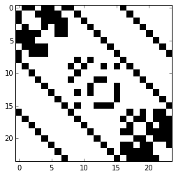
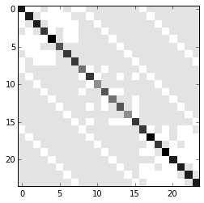

#### Import standard libraries for numerics and plots

    import numpy as np
    import matplotlib.pyplot as plt

#### Import the package MultiNetX

    import multinetx as mx

#### Create three Erd"os- R'enyi networks with N nodes for each layer

    N = 8
    g1 = mx.generators.erdos_renyi_graph(N,0.5,seed=218)
    g2 = mx.generators.erdos_renyi_graph(N,0.6,seed=211)
    g3 = mx.generators.erdos_renyi_graph(N,0.7,seed=208)

#### Create an 3Nx3N lil sparse matrix. It will be used to describe the layers interconnection

    adj_block = mx.lil_matrix(np.zeros((N*3,N*3)))

#### Define the type of interconnection among the layers (here we use identity matrices thus connecting one-to-one the nodes among layers)

    adj_block[0:  N,  N:2*N] = np.identity(N)    # L_12
    adj_block[0:  N,2*N:3*N] = np.identity(N)    # L_13
    adj_block[N:2*N,2*N:3*N] = np.identity(N)    # L_23
    
    # use symmetric inter-adjacency matrix
    adj_block += adj_block.T

#### Create an instance of the MultilayerGraph class

    mg = mx.MultilayerGraph(list_of_layers=[g1,g2,g3],
                            inter_adjacency_matrix=adj_block)

#### Weights can be added to the edges

    mg.set_edges_weights(intra_layer_edges_weight=2,
                         inter_layer_edges_weight=3)

#### Take some information for the multiplex network

    print 'MultiNetX name:\n', mg.name ,'\n', mg.info(),'\n'

    MultiNetX name:
    multilayer_gnp_random_graph(8,0.5)_gnp_random_graph(8,0.6)_gnp_random_graph(8,0.7) 
    3-layer graph, intra_layer_edges:48, inter_layer_edges:24, number_of_nodes_in_layer:8  
    

    print 'MultilayerGraph edges:',\
            '\n\n intra-layer edges: ',mg.get_intra_layer_edges(),\
            '\n\n inter-layer edges: ',mg.get_inter_layer_edges(),'\n' 

    MultilayerGraph edges: 
    
     intra-layer edges:  [(0, 1), (0, 2), (0, 4), (0, 5), (0, 7), (1, 3), (1, 4), (1, 5), (1, 6), (2, 4), (2, 5), (2, 6), (2, 7), (3, 4), (3, 6), (3, 7), (4, 6), (4, 7), (8, 9), (8, 11), (9, 10), (9, 13), (9, 15), (11, 12), (11, 13), (12, 15), (13, 15), (14, 15), (16, 17), (16, 19), (16, 21), (16, 22), (17, 18), (17, 19), (17, 21), (17, 22), (17, 23), (18, 20), (18, 22), (18, 23), (19, 20), (19, 21), (19, 22), (19, 23), (20, 21), (20, 22), (20, 23), (21, 23)] 
    
     inter-layer edges:  [(8, 0), (9, 1), (10, 2), (11, 3), (12, 4), (13, 5), (14, 6), (15, 7), (16, 0), (16, 8), (17, 1), (17, 9), (18, 2), (18, 10), (19, 3), (19, 11), (20, 4), (20, 12), (21, 5), (21, 13), (22, 6), (22, 14), (23, 7), (23, 15)] 
    

    print 'intralayer edges of 1: ',mg.get_intra_layer_edges_of_layer(layer=0)
    print 'intralayer edges of 2: ',mg.get_intra_layer_edges_of_layer(layer=1)
    print 'intralayer edges of 3: ',mg.get_intra_layer_edges_of_layer(layer=2)

    intralayer edges of 1:  [(0, 1), (0, 2), (0, 4), (0, 5), (0, 7), (1, 3), (1, 4), (1, 5), (1, 6), (2, 4), (2, 5), (2, 6), (2, 7), (3, 4), (3, 6), (3, 7), (4, 6), (4, 7)]
    intralayer edges of 2:  [(8, 9), (8, 11), (9, 10), (9, 13), (9, 15), (11, 12), (11, 13), (12, 15), (13, 15), (14, 15)]
    intralayer edges of 3:  [(16, 17), (16, 19), (16, 21), (16, 22), (17, 18), (17, 19), (17, 21), (17, 22), (17, 23), (18, 20), (18, 22), (18, 23), (19, 20), (19, 21), (19, 22), (19, 23), (20, 21), (20, 22), (20, 23), (21, 23)]

#### A layer can be chosen: it is a networkx.Graph so it inherits all of its properties.

    layer = 1
    mg1 = mg.get_layer(layer-1)
    print 'layer', layer, ' name is', mg1.name

    layer 1  name is gnp_random_graph(8,0.5)

    print 'Adjacency matrix:\n', \
            mx.adjacency_matrix(mg,weight=None).todense(),'\n'
    print 'Adjacency matrix (weighted):\n', \
            mx.adjacency_matrix(mg,weight="weight").todense(),'\n'

    Adjacency matrix:
    [[0 1 1 0 1 1 0 1 1 0 0 0 0 0 0 0 1 0 0 0 0 0 0 0]
     [1 0 0 1 1 1 1 0 0 1 0 0 0 0 0 0 0 1 0 0 0 0 0 0]
     [1 0 0 0 1 1 1 1 0 0 1 0 0 0 0 0 0 0 1 0 0 0 0 0]
     [0 1 0 0 1 0 1 1 0 0 0 1 0 0 0 0 0 0 0 1 0 0 0 0]
     [1 1 1 1 0 0 1 1 0 0 0 0 1 0 0 0 0 0 0 0 1 0 0 0]
     [1 1 1 0 0 0 0 0 0 0 0 0 0 1 0 0 0 0 0 0 0 1 0 0]
     [0 1 1 1 1 0 0 0 0 0 0 0 0 0 1 0 0 0 0 0 0 0 1 0]
     [1 0 1 1 1 0 0 0 0 0 0 0 0 0 0 1 0 0 0 0 0 0 0 1]
     [1 0 0 0 0 0 0 0 0 1 0 1 0 0 0 0 1 0 0 0 0 0 0 0]
     [0 1 0 0 0 0 0 0 1 0 1 0 0 1 0 1 0 1 0 0 0 0 0 0]
     [0 0 1 0 0 0 0 0 0 1 0 0 0 0 0 0 0 0 1 0 0 0 0 0]
     [0 0 0 1 0 0 0 0 1 0 0 0 1 1 0 0 0 0 0 1 0 0 0 0]
     [0 0 0 0 1 0 0 0 0 0 0 1 0 0 0 1 0 0 0 0 1 0 0 0]
     [0 0 0 0 0 1 0 0 0 1 0 1 0 0 0 1 0 0 0 0 0 1 0 0]
     [0 0 0 0 0 0 1 0 0 0 0 0 0 0 0 1 0 0 0 0 0 0 1 0]
     [0 0 0 0 0 0 0 1 0 1 0 0 1 1 1 0 0 0 0 0 0 0 0 1]
     [1 0 0 0 0 0 0 0 1 0 0 0 0 0 0 0 0 1 0 1 0 1 1 0]
     [0 1 0 0 0 0 0 0 0 1 0 0 0 0 0 0 1 0 1 1 0 1 1 1]
     [0 0 1 0 0 0 0 0 0 0 1 0 0 0 0 0 0 1 0 0 1 0 1 1]
     [0 0 0 1 0 0 0 0 0 0 0 1 0 0 0 0 1 1 0 0 1 1 1 1]
     [0 0 0 0 1 0 0 0 0 0 0 0 1 0 0 0 0 0 1 1 0 1 1 1]
     [0 0 0 0 0 1 0 0 0 0 0 0 0 1 0 0 1 1 0 1 1 0 0 1]
     [0 0 0 0 0 0 1 0 0 0 0 0 0 0 1 0 1 1 1 1 1 0 0 0]
     [0 0 0 0 0 0 0 1 0 0 0 0 0 0 0 1 0 1 1 1 1 1 0 0]] 
    
    Adjacency matrix (weighted):
    [[0 2 2 0 2 2 0 2 3 0 0 0 0 0 0 0 3 0 0 0 0 0 0 0]
     [2 0 0 2 2 2 2 0 0 3 0 0 0 0 0 0 0 3 0 0 0 0 0 0]
     [2 0 0 0 2 2 2 2 0 0 3 0 0 0 0 0 0 0 3 0 0 0 0 0]
     [0 2 0 0 2 0 2 2 0 0 0 3 0 0 0 0 0 0 0 3 0 0 0 0]
     [2 2 2 2 0 0 2 2 0 0 0 0 3 0 0 0 0 0 0 0 3 0 0 0]
     [2 2 2 0 0 0 0 0 0 0 0 0 0 3 0 0 0 0 0 0 0 3 0 0]
     [0 2 2 2 2 0 0 0 0 0 0 0 0 0 3 0 0 0 0 0 0 0 3 0]
     [2 0 2 2 2 0 0 0 0 0 0 0 0 0 0 3 0 0 0 0 0 0 0 3]
     [3 0 0 0 0 0 0 0 0 2 0 2 0 0 0 0 3 0 0 0 0 0 0 0]
     [0 3 0 0 0 0 0 0 2 0 2 0 0 2 0 2 0 3 0 0 0 0 0 0]
     [0 0 3 0 0 0 0 0 0 2 0 0 0 0 0 0 0 0 3 0 0 0 0 0]
     [0 0 0 3 0 0 0 0 2 0 0 0 2 2 0 0 0 0 0 3 0 0 0 0]
     [0 0 0 0 3 0 0 0 0 0 0 2 0 0 0 2 0 0 0 0 3 0 0 0]
     [0 0 0 0 0 3 0 0 0 2 0 2 0 0 0 2 0 0 0 0 0 3 0 0]
     [0 0 0 0 0 0 3 0 0 0 0 0 0 0 0 2 0 0 0 0 0 0 3 0]
     [0 0 0 0 0 0 0 3 0 2 0 0 2 2 2 0 0 0 0 0 0 0 0 3]
     [3 0 0 0 0 0 0 0 3 0 0 0 0 0 0 0 0 2 0 2 0 2 2 0]
     [0 3 0 0 0 0 0 0 0 3 0 0 0 0 0 0 2 0 2 2 0 2 2 2]
     [0 0 3 0 0 0 0 0 0 0 3 0 0 0 0 0 0 2 0 0 2 0 2 2]
     [0 0 0 3 0 0 0 0 0 0 0 3 0 0 0 0 2 2 0 0 2 2 2 2]
     [0 0 0 0 3 0 0 0 0 0 0 0 3 0 0 0 0 0 2 2 0 2 2 2]
     [0 0 0 0 0 3 0 0 0 0 0 0 0 3 0 0 2 2 0 2 2 0 0 2]
     [0 0 0 0 0 0 3 0 0 0 0 0 0 0 3 0 2 2 2 2 2 0 0 0]
     [0 0 0 0 0 0 0 3 0 0 0 0 0 0 0 3 0 2 2 2 2 2 0 0]] 
    

    %matplotlib inline

    fig = plt.figure()
    ax = fig.add_subplot(111)
    ax.imshow(mx.adjacency_matrix(mg,weight=None).todense(),
              origin='upper',interpolation='nearest',cmap=plt.cm.binary);

    print 'Laplacian matrix:\n',\
            mx.laplacian_matrix(mg,weight=None).todense(),'\n'
    print 'Laplacian matrix (weighted):\n', \
            mx.laplacian_matrix(mg,weight="weight").todense(),'\n'

    Laplacian matrix:
    [[ 7 -1 -1  0 -1 -1  0 -1 -1  0  0  0  0  0  0  0 -1  0  0  0  0  0  0  0]
     [-1  7  0 -1 -1 -1 -1  0  0 -1  0  0  0  0  0  0  0 -1  0  0  0  0  0  0]
     [-1  0  7  0 -1 -1 -1 -1  0  0 -1  0  0  0  0  0  0  0 -1  0  0  0  0  0]
     [ 0 -1  0  6 -1  0 -1 -1  0  0  0 -1  0  0  0  0  0  0  0 -1  0  0  0  0]
     [-1 -1 -1 -1  8  0 -1 -1  0  0  0  0 -1  0  0  0  0  0  0  0 -1  0  0  0]
     [-1 -1 -1  0  0  5  0  0  0  0  0  0  0 -1  0  0  0  0  0  0  0 -1  0  0]
     [ 0 -1 -1 -1 -1  0  6  0  0  0  0  0  0  0 -1  0  0  0  0  0  0  0 -1  0]
     [-1  0 -1 -1 -1  0  0  6  0  0  0  0  0  0  0 -1  0  0  0  0  0  0  0 -1]
     [-1  0  0  0  0  0  0  0  4 -1  0 -1  0  0  0  0 -1  0  0  0  0  0  0  0]
     [ 0 -1  0  0  0  0  0  0 -1  6 -1  0  0 -1  0 -1  0 -1  0  0  0  0  0  0]
     [ 0  0 -1  0  0  0  0  0  0 -1  3  0  0  0  0  0  0  0 -1  0  0  0  0  0]
     [ 0  0  0 -1  0  0  0  0 -1  0  0  5 -1 -1  0  0  0  0  0 -1  0  0  0  0]
     [ 0  0  0  0 -1  0  0  0  0  0  0 -1  4  0  0 -1  0  0  0  0 -1  0  0  0]
     [ 0  0  0  0  0 -1  0  0  0 -1  0 -1  0  5  0 -1  0  0  0  0  0 -1  0  0]
     [ 0  0  0  0  0  0 -1  0  0  0  0  0  0  0  3 -1  0  0  0  0  0  0 -1  0]
     [ 0  0  0  0  0  0  0 -1  0 -1  0  0 -1 -1 -1  6  0  0  0  0  0  0  0 -1]
     [-1  0  0  0  0  0  0  0 -1  0  0  0  0  0  0  0  6 -1  0 -1  0 -1 -1  0]
     [ 0 -1  0  0  0  0  0  0  0 -1  0  0  0  0  0  0 -1  8 -1 -1  0 -1 -1 -1]
     [ 0  0 -1  0  0  0  0  0  0  0 -1  0  0  0  0  0  0 -1  6  0 -1  0 -1 -1]
     [ 0  0  0 -1  0  0  0  0  0  0  0 -1  0  0  0  0 -1 -1  0  8 -1 -1 -1 -1]
     [ 0  0  0  0 -1  0  0  0  0  0  0  0 -1  0  0  0  0  0 -1 -1  7 -1 -1 -1]
     [ 0  0  0  0  0 -1  0  0  0  0  0  0  0 -1  0  0 -1 -1  0 -1 -1  7  0 -1]
     [ 0  0  0  0  0  0 -1  0  0  0  0  0  0  0 -1  0 -1 -1 -1 -1 -1  0  7  0]
     [ 0  0  0  0  0  0  0 -1  0  0  0  0  0  0  0 -1  0 -1 -1 -1 -1 -1  0  7]] 
    
    Laplacian matrix (weighted):
    [[16 -2 -2  0 -2 -2  0 -2 -3  0  0  0  0  0  0  0 -3  0  0  0  0  0  0  0]
     [-2 16  0 -2 -2 -2 -2  0  0 -3  0  0  0  0  0  0  0 -3  0  0  0  0  0  0]
     [-2  0 16  0 -2 -2 -2 -2  0  0 -3  0  0  0  0  0  0  0 -3  0  0  0  0  0]
     [ 0 -2  0 14 -2  0 -2 -2  0  0  0 -3  0  0  0  0  0  0  0 -3  0  0  0  0]
     [-2 -2 -2 -2 18  0 -2 -2  0  0  0  0 -3  0  0  0  0  0  0  0 -3  0  0  0]
     [-2 -2 -2  0  0 12  0  0  0  0  0  0  0 -3  0  0  0  0  0  0  0 -3  0  0]
     [ 0 -2 -2 -2 -2  0 14  0  0  0  0  0  0  0 -3  0  0  0  0  0  0  0 -3  0]
     [-2  0 -2 -2 -2  0  0 14  0  0  0  0  0  0  0 -3  0  0  0  0  0  0  0 -3]
     [-3  0  0  0  0  0  0  0 10 -2  0 -2  0  0  0  0 -3  0  0  0  0  0  0  0]
     [ 0 -3  0  0  0  0  0  0 -2 14 -2  0  0 -2  0 -2  0 -3  0  0  0  0  0  0]
     [ 0  0 -3  0  0  0  0  0  0 -2  8  0  0  0  0  0  0  0 -3  0  0  0  0  0]
     [ 0  0  0 -3  0  0  0  0 -2  0  0 12 -2 -2  0  0  0  0  0 -3  0  0  0  0]
     [ 0  0  0  0 -3  0  0  0  0  0  0 -2 10  0  0 -2  0  0  0  0 -3  0  0  0]
     [ 0  0  0  0  0 -3  0  0  0 -2  0 -2  0 12  0 -2  0  0  0  0  0 -3  0  0]
     [ 0  0  0  0  0  0 -3  0  0  0  0  0  0  0  8 -2  0  0  0  0  0  0 -3  0]
     [ 0  0  0  0  0  0  0 -3  0 -2  0  0 -2 -2 -2 14  0  0  0  0  0  0  0 -3]
     [-3  0  0  0  0  0  0  0 -3  0  0  0  0  0  0  0 14 -2  0 -2  0 -2 -2  0]
     [ 0 -3  0  0  0  0  0  0  0 -3  0  0  0  0  0  0 -2 18 -2 -2  0 -2 -2 -2]
     [ 0  0 -3  0  0  0  0  0  0  0 -3  0  0  0  0  0  0 -2 14  0 -2  0 -2 -2]
     [ 0  0  0 -3  0  0  0  0  0  0  0 -3  0  0  0  0 -2 -2  0 18 -2 -2 -2 -2]
     [ 0  0  0  0 -3  0  0  0  0  0  0  0 -3  0  0  0  0  0 -2 -2 16 -2 -2 -2]
     [ 0  0  0  0  0 -3  0  0  0  0  0  0  0 -3  0  0 -2 -2  0 -2 -2 16  0 -2]
     [ 0  0  0  0  0  0 -3  0  0  0  0  0  0  0 -3  0 -2 -2 -2 -2 -2  0 16  0]
     [ 0  0  0  0  0  0  0 -3  0  0  0  0  0  0  0 -3  0 -2 -2 -2 -2 -2  0 16]] 
    

    fig = plt.figure()
    ax = fig.add_subplot(111)
    ax.imshow(mx.laplacian_matrix(mg,weight=None).todense(),
              origin='upper',interpolation='nearest',cmap=plt.cm.binary);

    print 'Laplacian spectrum:\n', \
            mx.laplacian_spectrum(mg,weight="weight"),'\n'

    Laplacian spectrum:
    [  9.76996261e-15   5.15029450e+00   5.22142934e+00   6.50633452e+00
       7.24201854e+00   9.00000000e+00   9.00000000e+00   9.04102492e+00
       9.69731270e+00   1.07354686e+01   1.40054670e+01   1.48276846e+01
       1.55156225e+01   1.66427755e+01   1.75956660e+01   1.78156590e+01
       1.84139912e+01   1.88493020e+01   2.04976307e+01   2.08309187e+01
       2.11225467e+01   2.22099426e+01   2.27741319e+01   2.33047783e+01] 
    

    

    

    
