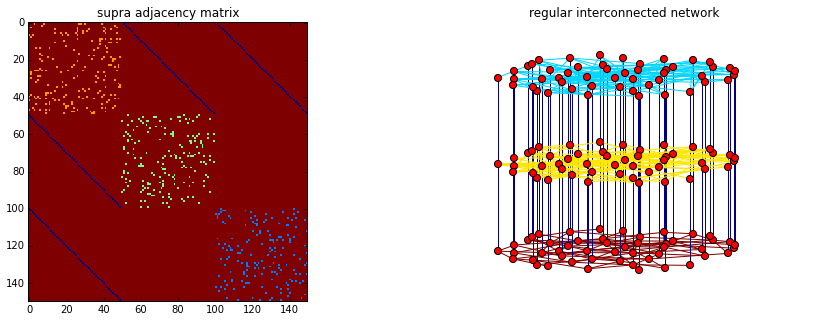
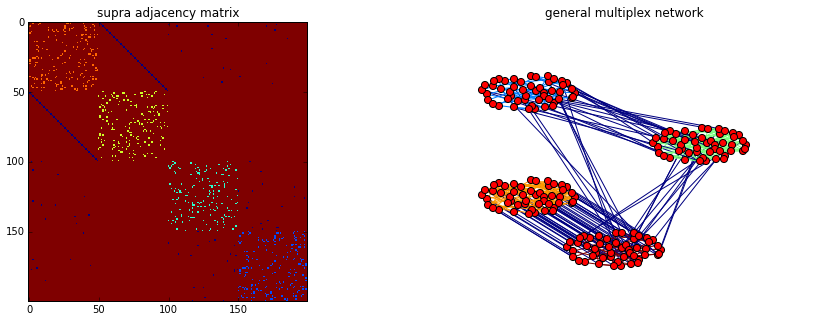

##### Import standard libraries

    import numpy as np
    import matplotlib.pyplot as plt
    %matplotlib inline

##### Import the package MultiNetX

    import multinetx as mx

##### Create three Erd"os- R'enyi networks with N nodes for each layer

    N = 50
    g1 = mx.erdos_renyi_graph(N,0.07,seed=218)
    g2 = mx.erdos_renyi_graph(N,0.07,seed=211)
    g3 = mx.erdos_renyi_graph(N,0.07,seed=208)

### Edge colored nertwork (no inter-connected layers)

##### Create the multiplex network

    mg = mx.MultilayerGraph(list_of_layers=[g1,g2,g3])

##### Set weights to the edges

    mg.set_intra_edges_weights(layer=0,weight=1)
    mg.set_intra_edges_weights(layer=1,weight=2)
    mg.set_intra_edges_weights(layer=2,weight=3)

##### Plot the adjacency matrix and the multiplex networks

    fig = plt.figure(figsize=(15,5))
    ax1 = fig.add_subplot(121)
    ax1.imshow(mx.adjacency_matrix(mg,weight='weight').todense(),
              origin='upper',interpolation='nearest',cmap=plt.cm.jet_r)
    ax1.set_title('supra adjacency matrix')
    
    ax2 = fig.add_subplot(122)
    ax2.axis('off')
    ax2.set_title('edge colored network')
    pos = mx.get_position(mg,mx.fruchterman_reingold_layout(g1),
                          layer_vertical_shift=0.2,
                          layer_horizontal_shift=0.0,
                          proj_angle=47)
    mx.draw_networkx(mg,pos=pos,ax=ax2,node_size=50,with_labels=False,
                     edge_color=[mg[a][b]['weight'] for a,b in mg.edges()],
                     edge_cmap=plt.cm.jet_r)
    plt.show()

### Regular interconnected multiplex

##### Define the type of interconnection between the layers

    adj_block = mx.lil_matrix(np.zeros((N*3,N*3)))
    
    adj_block[0:  N,  N:2*N] = np.identity(N)    # L_12
    adj_block[0:  N,2*N:3*N] = np.identity(N)    # L_13
    #adj_block[N:2*N,2*N:3*N] = np.identity(N)    # L_23
    adj_block += adj_block.T

##### Create an instance of the MultilayerGraph class

    mg = mx.MultilayerGraph(list_of_layers=[g1,g2,g3], 
                            inter_adjacency_matrix=adj_block)
    
    mg.set_edges_weights(inter_layer_edges_weight=4)
    
    mg.set_intra_edges_weights(layer=0,weight=1)
    mg.set_intra_edges_weights(layer=1,weight=2)
    mg.set_intra_edges_weights(layer=2,weight=3)

##### Plot the adjacency matrix and the multiplex networks

    fig = plt.figure(figsize=(15,5))
    ax1 = fig.add_subplot(121)
    ax1.imshow(mx.adjacency_matrix(mg,weight='weight').todense(),
              origin='upper',interpolation='nearest',cmap=plt.cm.jet_r)
    ax1.set_title('supra adjacency matrix')
    
    ax2 = fig.add_subplot(122)
    ax2.axis('off')
    ax2.set_title('regular interconnected network')
    pos = mx.get_position(mg,mx.fruchterman_reingold_layout(mg.get_layer(0)),
                          layer_vertical_shift=1.4,
                          layer_horizontal_shift=0.0,
                          proj_angle=7)
    mx.draw_networkx(mg,pos=pos,ax=ax2,node_size=50,with_labels=False,
                     edge_color=[mg[a][b]['weight'] for a,b in mg.edges()],
                     edge_cmap=plt.cm.jet_r)
    plt.show()

### General multiplex multiplex 

##### Define the type of interconnection between the layers

    adj_block = mx.lil_matrix(np.zeros((N*4,N*4)))
    
    adj_block[0  :  N ,   N:2*N] = np.identity(N)   # L_12
    adj_block[0  :  N , 2*N:3*N] = np.random.poisson(0.005,size=(N,N))   # L_13
    adj_block[0  :  N , 3*N:4*N] = np.random.poisson(0.006,size=(N,N))   # L_34
    adj_block[3*N:4*N , 2*N:3*N] = np.random.poisson(0.008,size=(N,N))   # L_14
    adj_block += adj_block.T
    adj_block[adj_block>1] = 1

##### Create an instance of the MultilayerGraph class

    mg = mx.MultilayerGraph(list_of_layers=[g1,g2,g3,g1],
                            inter_adjacency_matrix=adj_block)
    
    mg.set_edges_weights(inter_layer_edges_weight=5)
    
    mg.set_intra_edges_weights(layer=0,weight=1)
    mg.set_intra_edges_weights(layer=1,weight=2)
    mg.set_intra_edges_weights(layer=2,weight=3)
    mg.set_intra_edges_weights(layer=3,weight=4)

##### Plot the adjacency matrix and the multiplex networks

    fig = plt.figure(figsize=(15,5))
    ax1 = fig.add_subplot(121)
    ax1.imshow(mx.adjacency_matrix(mg,weight='weight').todense(),
              origin='upper',interpolation='nearest',cmap=plt.cm.jet_r)
    ax1.set_title('supra adjacency matrix')
    
    ax2 = fig.add_subplot(122)
    ax2.axis('off')
    ax2.set_title('general multiplex network')
    pos = mx.get_position(mg,mx.fruchterman_reingold_layout(mg.get_layer(0)),
                          layer_vertical_shift=.3,
                          layer_horizontal_shift=0.9,
                          proj_angle=.2)
    mx.draw_networkx(mg,pos=pos,ax=ax2,node_size=50,with_labels=False,
                     edge_color=[mg[a][b]['weight'] for a,b in mg.edges()],
                     edge_cmap=plt.cm.jet_r)
    plt.show()

    
